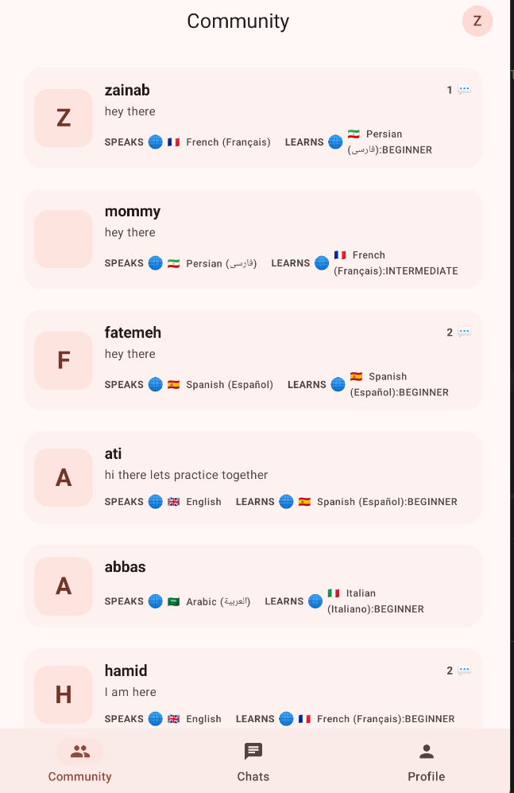
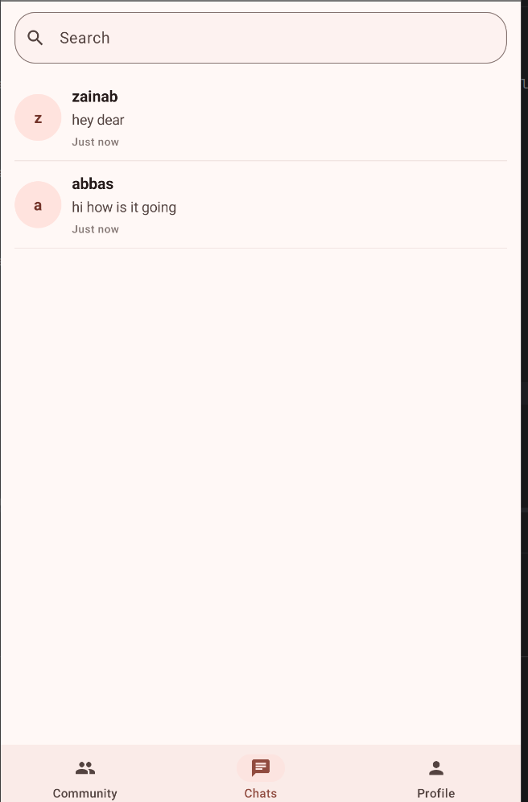
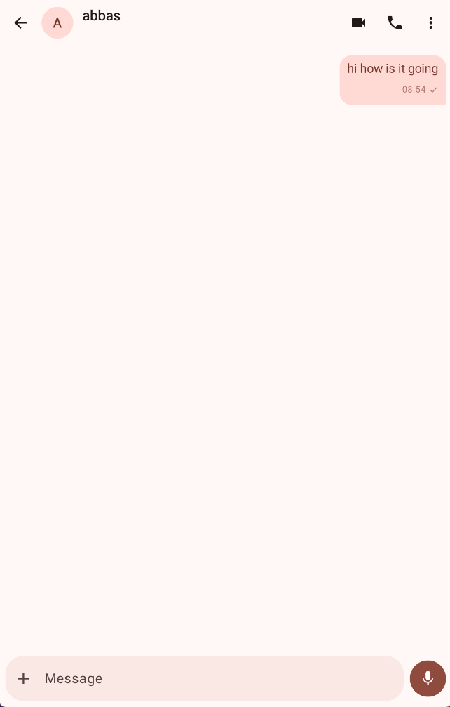
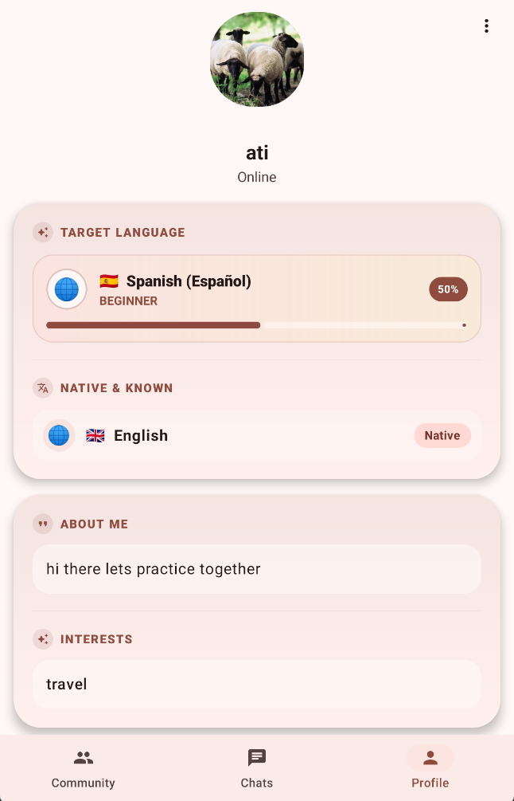
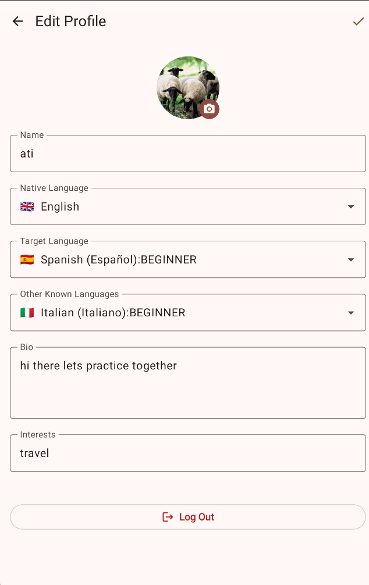

# 🌍 LingualMate

LingualMate is a modern Android application designed for language learners and international communities to connect, chat, and practice languages together in a friendly environment.

---

## ✨ Features

- **Community Feed:** Share posts, ask questions, and interact with fellow language learners worldwide.
- **Real-time Chat List:** Keep track of all active conversations and direct messages.
- **Interactive Chat Screen:** Clean messaging interface for seamless language practice.
- **Customizable Profiles:** Personalize your bio, target languages, and preferences.
- **Edit Profile Settings:** Easily update your personal information and language goals.

---

## 📸 App Screenshots

| Community Feed | Chat List | Chat Screen | Profile | Edit Profile |
| :---: | :---: | :---: | :---: | :---: |
|  |  |  |  |  |

---

## 🛠️ Tech Stack

- **Language:** Kotlin
- **UI Framework:** Jetpack Compose (Modern Declarative UI)
- **Architecture:** MVVM (Model-View-ViewModel)
- **Backend & Database:** Firebase (Cloud Firestore & Authentication)
- **Asynchronous Flow:** StateFlow & Coroutines
- **Dependency Injection:** Hilt

---


1. Clone the repository:
   ```bash
   git clone [https://github.com/zainabhajizade/LingualMate.git](https://github.com/zainabhajizade/LingualMate.git)
